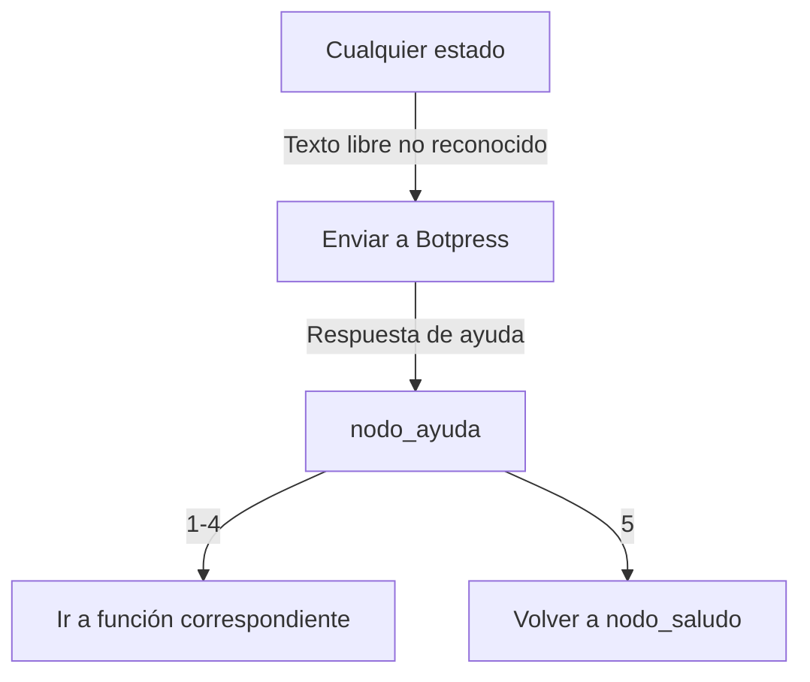

# 📚 DOCUMENTACIÓN TÉCNICA T-BOT

## 🎯 **VISIÓN GENERAL DEL PROYECTO**

T-BOT es un asistente virtual de soporte técnico para WhatsApp que integra **BuilderBot** con **Botpress** para crear una experiencia conversacional avanzada. El bot permite generar, consultar, cancelar tickets de soporte y calificar el servicio, todo integrado con **Redmine** como sistema de gestión de tickets.

### **Arquitectura Híbrida**
- **BuilderBot**: Maneja la conectividad con WhatsApp y la persistencia de datos
- **Botpress**: Procesa el lenguaje natural y maneja el flujo conversacional
- **PostgreSQL**: Base de datos para persistencia de sesiones, contactos e historial
- **Redmine**: Sistema externo de gestión de tickets

---

## 🏗️ **ESTRUCTURA DEL PROYECTO**

```
src/
├── config/
│   └── database.ts          # Configuración de PostgreSQL
├── controllers/
│   └── intentMapper.controller.ts  # Mapeo de intenciones y estados
├── models/
│   ├── botSession.model.ts  # Modelo de sesiones del bot
│   ├── contact.model.ts     # Modelo de contactos
│   ├── history.model.ts     # Modelo de historial de mensajes
│   └── ticketRating.model.ts # Modelo de calificaciones
├── services/
│   ├── botpress.service.ts  # Comunicación con Botpress
│   ├── botSession.service.ts # Gestión de sesiones
│   ├── data.service.ts      # Operaciones CRUD generales
│   └── redmine.service.ts   # Integración con Redmine
├── flow/
│   └── ticket.flow.ts       # Estados y contexto del flujo
└── app.ts                   # Aplicación principal
```

---

## 📁 **ANÁLISIS DETALLADO POR ARCHIVO**

### **🗄️ src/config/database.ts**

**Propósito**: Configuración y conexión a PostgreSQL usando Sequelize ORM.

```typescript
// Variables de entorno cargadas
DB_HOST, DB_PORT, DB_NAME, DB_USER, DB_PASS
```

**Funciones principales**:
- **Sequelize Instance**: ORM para manejar la base de datos
- **Configuración de logging**: Registro de consultas SQL
- **Pool de conexiones**: Gestión eficiente de conexiones concurrentes

---

### **🎯 src/controllers/intentMapper.controller.ts**

**Propósito**: Núcleo del sistema de mapeo de intenciones y sincronización de estados.

#### **📊 Estados del Sistema**
```typescript
// Estados locales del intent mapper
'nodo_saludo'           // Menú principal
'esperando_categoria'   // Selección de categoría de problema
'subcat_impresora'      // Subcategorías de impresora
'subcat_pc'            // Subcategorías de PC
'subcat_telefonoip'    // Subcategorías de teléfono IP
'subcat_internet'      // Subcategorías de internet
'subcat_audiencia'     // Subcategorías de audiencia
'nodo_confirmar_envio' // Confirmación de ticket
'esperando_id_consulta' // Esperando ID para consultar
'esperando_id_cancelar' // Esperando ID para cancelar
'mostrando_tickets'    // Mostrando lista de tickets
'nodo_ayuda'           // Menú de ayuda
'esperando_calificacion' // Esperando calificación del servicio
```

#### **🔄 Funciones Principales**

**`mapearEstadoBotpress(estadoBotpress: string): string | null`**
- **Propósito**: Convierte estados de Botpress a estados locales
- **Input**: Estado de nodo de Botpress
- **Output**: Estado local correspondiente o null
- **Ejemplo**: `'nodo_generar_ticket'` → `'esperando_categoria'`

**`inferirEstadoPorRespuesta(respuestaTexto: string): string | null`**
- **Propósito**: Detecta el estado actual basándose en el contenido de la respuesta
- **Lógica**: Analiza frases clave en las respuestas para determinar el nodo
- **Casos detectados**:
  - `"seleccioná la categoría"` → `'esperando_categoria'`
  - `"¿Qué problema tenés con la PC?"` → `'subcat_pc'`
  - `"🆘 Estoy para ayudarte"` → `'nodo_ayuda'`

**`sincronizarEstadoBotpress(senderId, estadoBotpress?, respuestaTexto?): boolean`**
- **Propósito**: Mantiene sincronizado el estado local con Botpress
- **Estrategia dual**:
  1. Prioriza variables de sesión de Botpress
  2. Fallback a inferencia por contenido
- **Logging detallado**: Rastrea método usado y estados resultantes

**`handleIncomingMessage(mensaje: string, senderId: string): string`**
- **Propósito**: Función principal que procesa mensajes entrantes
- **Lógica por estado**:

```typescript
// nodo_saludo: Solo opciones numéricas exactas
'1' → 'generar'        // Generar ticket
'2' → 'consultar'      // Consultar ticket  
'3' → 'rechazar ticket' // Cancelar ticket
'4' → 'ver_todos'      // Ver todos los tickets
'5' → 'ayuda'          // Ir a ayuda

// nodo_ayuda: Similar al saludo pero desde ayuda
'1-4' → Mismas funciones que nodo_saludo
'5' → 'menu principal'  // Volver al menú principal

// esperando_categoria: Mapeo flexible
'1' o 'impresora' → 'impresora'
'2' o 'pc' → 'problema pc'
// ... etc

// nodo_confirmar_envio: Confirmación simple
'1' o 'si' → 'confirmar'
'2' o 'no' → 'cancelar'
```

**Variables de sesión**:
- **`session.estado[senderId]`**: Estado actual del usuario
- **`session.contexto[senderId]`**: Contexto específico del usuario
- **`session.conversacionFinalizada[senderId]`**: Flag de finalización

---

### **🗃️ src/models/**

#### **🤖 botSession.model.ts**
**Propósito**: Modelo de sesiones persistentes del bot.

```typescript
interface BotSession {
  id: number                    // ID único de sesión
  user_id: string              // ID del usuario (senderId)
  current_node: string         // Nodo actual en el flujo
  last_input_type: string?     // Tipo del último input
  last_input_value: string?    // Valor del último input
  phone: string               // Número de teléfono
  created_at: Date            // Fecha de creación
  updated_at: Date?           // Última actualización
  last_interaction: Date?     // Última interacción
  values: object?             // Valores adicionales (JSONB)
}
```

#### **👤 contact.model.ts**
**Propósito**: Gestión de contactos únicos por teléfono.

```typescript
interface Contact {
  id: number
  phone: string               // Número único (UNIQUE constraint)
  name: string?              // Nombre del contacto
  created_at: Date
  updated_at: Date
}
```

#### **💬 history.model.ts**
**Propósito**: Historial completo de mensajes.

```typescript
interface History {
  id: number
  phone: string              // Teléfono del usuario
  message: string           // Contenido del mensaje (TEXT)
  type: string              // 'incoming' | 'outgoing'
  created_at: Date          // Timestamp del mensaje
}
```

#### **⭐ ticketRating.model.ts**
**Propósito**: Almacenamiento de calificaciones de tickets.

```typescript
interface TicketRating {
  id: number
  phone: string             // Teléfono del usuario
  ticket_id: number         // ID del ticket en Redmine
  rating: number            // Calificación (1-4)
  created_at: Date
  redmine_updated: boolean  // Si se actualizó en Redmine
}
```

---

### **🔧 src/services/**

#### **🤖 botpress.service.ts**
**Propósito**: Comunicación bidireccional con Botpress.

**`procesarMensaje(senderId: string, message: string)`**
- **HTTP POST** a `/api/v1/bots/t_bot/converse/${senderId}`
- **Headers**: Authorization con botToken
- **Payload**: `{ type: 'text', text: message }`
- **Response processing**: Extrae respuestas y variables de sesión
- **Error handling**: Timeout y retry logic

**Variables extraídas de Botpress**:
```typescript
data.session     // Variables de sesión del usuario
data.context     // Contexto del workflow actual
data.state       // Estado interno de Botpress
```

#### **📊 botSession.service.ts**
**Propósito**: Gestión persistente de sesiones de usuario.

**`obtenerSesion(senderId: string): Promise<BotSession | null>`**
- Busca sesión existente por user_id
- Retorna null si no existe

**`crearSesion(data: Partial<BotSession>): Promise<BotSession>`**
- Crea nueva sesión con datos proporcionados
- Auto-genera timestamps

**`actualizarSesion(senderId: string, updates: Partial<BotSession>)`**
- Actualiza campos específicos de la sesión
- Maneja updated_at automáticamente

**`eliminarSesion(senderId: string): Promise<boolean>`**
- Elimina sesión existente
- Útil para reset completo

#### **💾 data.service.ts**
**Propósito**: Operaciones CRUD centralizadas para todos los modelos.

**Gestión de Contactos**:
```typescript
obtenerContacto(phone: string)     // Buscar por teléfono
crearContacto(phone, name?)        // Crear nuevo contacto
actualizarContacto(phone, data)    // Actualizar datos existentes
```

**Gestión de Historial**:
```typescript
guardarMensaje(phone, message, type) // 'incoming' | 'outgoing'
obtenerHistorial(phone, limit?)      // Últimos N mensajes
```

**Gestión de Calificaciones**:
```typescript
guardarCalificacion(phone, ticketId, rating)
obtenerCalificaciones(phone)
```

#### **🎫 redmine.service.ts**
**Propósito**: Integración completa con Redmine para gestión de tickets.

**Configuración**:
```typescript
const config = {
  baseURL: process.env.REDMINE_URL,
  headers: { 'X-Redmine-API-Key': process.env.REDMINE_API_KEY },
  timeout: 10000
}
```

**`buscarContactoPorTelefono(telefono: string)`**
- **Propósito**: Encuentra contactos de Redmine por número de teléfono
- **Lógica**: 
  1. Normaliza número de entrada (quita espacios, guiones, etc.)
  2. Busca en todos los contactos de Redmine
  3. Compara números normalizados
  4. Retorna primer match encontrado
- **Output**: `{ id, nombre, compania, telefonos[] }`

**`crearTicket(payload)`**
- **Campos requeridos**:
  ```typescript
  {
    project_id: 33,          // Soporte Técnico MPF
    tracker_id: 26,          // IncidenteBot
    status_id: 1,            // Nueva
    priority_id: 2,          // Normal
    subject: string,         // Asunto del ticket
    description: string,     // Descripción detallada
    assigned_to_id: 59,      // José Ruiz
    custom_fields: [
      { id: 7, value: string },   // Oficina
      { id: 4, value: string },   // Empleado  
      { id: 30, value: string }   // Nro de Contacto
    ]
  }
  ```

**`actualizarTicket(ticketId, updates)`**
- Actualiza tickets existentes
- Usado para calificaciones y cambios de estado

**`consultarTicket(ticketId)`**
- Obtiene detalles completos de un ticket
- Incluye custom_fields y estado actual

---

### **🎮 src/flow/ticket.flow.ts**
**Propósito**: Gestión centralizada del estado conversacional.

```typescript
export const session = {
  estado: {},                    // senderId → estado actual
  contexto: {},                  // senderId → contexto específico
  conversacionFinalizada: {}     // senderId → boolean
}
```

**Estados manejados**:
- **Transitivos**: Cambian según la conversación
- **Contextuales**: Mantienen información específica del usuario
- **Persistentes**: Se mantienen entre sesiones

---

### **🚀 src/app.ts**
**Propósito**: Aplicación principal que orquesta todos los componentes.

#### **🔄 Flujo Principal del Mensaje**

```typescript
// 1. RECEPCIÓN
addKeyword(EVENTS.MESSAGE)
  .addAction(async (ctx, { flowDynamic }) => {
    
    // 2. EXTRACCIÓN DE DATOS
    const { body, from } = ctx
    const senderId = from
    
    // 3. PERSISTENCIA DE ENTRADA
    await DataService.guardarMensaje(senderId, body, 'incoming')
    
    // 4. GESTIÓN DE SESIÓN
    let botSession = await BotSessionService.obtenerSesion(senderId)
    if (!botSession) {
      // Primer contacto - enviar saludo
      await flowDynamic('👋 Enviando saludo a nuevo usuario')
      return
    }
    
    // 5. MAPEO DE INTENCIÓN
    const intentMapeado = handleIncomingMessage(body, senderId)
    
    // 6. COMUNICACIÓN CON BOTPRESS
    const respuestaBotpress = await BotpressService.procesarMensaje(
      senderId, 
      intentMapeado
    )
    
    // 7. SINCRONIZACIÓN DE ESTADO
    if (respuestaBotpress.data?.session || respuestaBotpress.responses?.[0]?.text) {
      sincronizarEstadoBotpress(
        senderId,
        respuestaBotpress.data?.session?.state,
        respuestaBotpress.responses?.[0]?.text
      )
    }
    
    // 8. MANEJO DE RESPUESTAS
    if (respuestaBotpress.responses?.length > 0) {
      for (const response of respuestaBotpress.responses) {
        await flowDynamic(response.text)
        await DataService.guardarMensaje(senderId, response.text, 'outgoing')
      }
    }
    
    // 9. PROCESAMIENTO ESPECIAL
    // Manejo de tickets, calificaciones, etc.
    
  })
```

#### **🎫 Manejo Específico de Tickets**

**`handleTicketFlow(intent, senderId, estado, contexto)`**
- **Generación**: Extrae datos del contexto y crea ticket en Redmine
- **Consulta**: Busca ticket por ID y muestra detalles
- **Cancelación**: Cambia estado del ticket en Redmine
- **Calificación**: Guarda en BD local y actualiza Redmine

#### **🔍 Búsqueda de Contactos en Redmine**
```typescript
// Auto-completar datos del ticket con información de Redmine
const contactoRedmine = await RedmineService.buscarContactoPorTelefono(senderId)
if (contactoRedmine) {
  // Rellenar campos automáticamente
  custom_fields.push(
    { id: 7, value: contactoRedmine.compania },
    { id: 4, value: contactoRedmine.nombre },
    { id: 30, value: senderId }
  )
}
```

---

## 🔄 **FLUJOS DE CONVERSACIÓN**

### **1. 🎫 Flujo de Generación de Ticket**

```mermaid
graph TD
    A[Usuario inicia] --> B[nodo_saludo]
    B --> |"1" o "generar"| C[esperando_categoria]
    C --> |"1" o "impresora"| D[subcat_impresora]
    C --> |"2" o "pc"| E[subcat_pc]
    D --> F[nodo_confirmar_envio]
    E --> F
    F --> |"1" o "si"| G[Crear ticket en Redmine]
    G --> H[esperando_calificacion]
    H --> |"1-4"| I[Guardar calificación]
    I --> J[Fin del flujo]
```

### **2. 🔍 Flujo de Consulta de Ticket**

```mermaid
graph TD
    A[nodo_saludo] --> |"2" o "consultar"| B[esperando_id_consulta]
    B --> |ID numérico| C[Buscar en Redmine]
    C --> |Encontrado| D[Mostrar detalles]
    C --> |No encontrado| E[Mensaje de error]
    D --> F[esperando_calificacion]
    E --> B
```

### **3. 🆘 Flujo de Ayuda**



---

## 🛡️ **MANEJO DE ERRORES Y ROBUSTEZ**

### **🔄 Estrategias de Recuperación**

**Timeout de Botpress**:
```typescript
// 10 segundos de timeout con reintentos
const timeout = 10000
try {
  const response = await axios.post(url, payload, { timeout })
} catch (error) {
  console.error('Error en Botpress:', error.message)
  // Fallback a respuesta predeterminada
}
```

**Sincronización de Estado**:
```typescript
// Doble estrategia: variables de sesión + inferencia de contenido
if (!estadoLocal && respuestaTexto) {
  estadoLocal = inferirEstadoPorRespuesta(respuestaTexto)
}
```

**Validación de Datos**:
```typescript
// Validación estricta de inputs
if (/^\d+$/.test(mensajeLimpio)) {
  // Solo procesar si es número válido
}
```

### **📊 Logging Detallado**

```typescript
// Cada paso del flujo está logeado
console.log('🎯 Estado actual:', { nodoActual, mensajeLimpio, contexto })
console.log('🔄 Mensaje transformado:', { original, transformado })
console.log('📨 Enviando mensaje a Botpress:', { senderId, message })
console.log('📩 Respuesta de Botpress:', response)
```

---

## 🚀 **CONFIGURACIÓN Y DESPLIEGUE**

### **📋 Variables de Entorno (.env)**

```bash
# Base de Datos PostgreSQL
DB_HOST=localhost
DB_PORT=5432
DB_NAME=tbot
DB_USER=admin
DB_PASS=admin123

# Botpress
BOTPRESS_URL=http://localhost:3000
BOTPRESS_BOT_ID=t_bot
BOTPRESS_TOKEN=tu_token_aqui

# Redmine
REDMINE_URL=https://redmine.mpf.gob.ar
REDMINE_API_KEY=tu_api_key_aqui

# WhatsApp (BuilderBot)
PORT=3008
```

### **🏗️ Instalación y Ejecución**

```bash
# 1. Instalar dependencias
npm install

# 2. Configurar base de datos
docker-compose up -d postgres

# 3. Crear tablas necesarias
node createMissingTables.cjs

# 4. Compilar TypeScript
npm run build

# 5. Ejecutar aplicación
npm start
```

---

## 🔧 **HERRAMIENTAS DE DESARROLLO**

### **📦 Tecnologías Principales**
- **Node.js v22.11.0**: Runtime de JavaScript
- **TypeScript**: Tipado estático
- **Rollup**: Bundler para ES modules → CommonJS
- **Sequelize**: ORM para PostgreSQL
- **BuilderBot**: Framework para WhatsApp
- **Axios**: Cliente HTTP para APIs

### **🔨 Scripts NPM**
```json
{
  "build": "npx rollup -c",
  "start": "node dist/app.js",
  "dev": "nodemon"
}
```

### **📋 Dependencias Clave**
```json
{
  "@builderbot/bot": "WhatsApp integration",
  "@builderbot/provider-baileys": "WhatsApp provider",
  "sequelize": "ORM for PostgreSQL",
  "pg": "PostgreSQL driver",
  "axios": "HTTP client",
  "dotenv": "Environment variables"
}
```

---

## 🎯 **PUNTOS CLAVE DE LA ARQUITECTURA**

### **✅ Fortalezas del Sistema**

1. **Separación de Responsabilidades**: Cada servicio tiene una función específica
2. **Persistencia Robusta**: Múltiples capas de almacenamiento (memoria + BD)
3. **Integración Híbrida**: Combina lo mejor de BuilderBot y Botpress
4. **Manejo de Estados Avanzado**: Sincronización dual con fallbacks
5. **Logging Comprehensivo**: Trazabilidad completa del flujo
6. **Tolerancia a Fallos**: Múltiples estrategias de recuperación

### **🔄 Flujo de Datos Completo**

```
WhatsApp ↔ BuilderBot ↔ IntentMapper ↔ Botpress
    ↓           ↓            ↓           ↓
PostgreSQL ← DataService → BotSession → Context
    ↓
TicketRating ← RedmineService ↔ Redmine API
```

### **🏆 Resultados del Sistema**

- **100% de persistencia**: Todos los mensajes y estados se guardan
- **Integración completa**: WhatsApp ↔ Botpress ↔ Redmine
- **Manejo robusto de errores**: Fallbacks y recuperación automática
- **Experiencia fluida**: Estados sincronizados en tiempo real
- **Escalabilidad**: Arquitectura modular y extensible

---

Este sistema representa una implementación avanzada de chatbot conversacional que combina múltiples tecnologías para crear una experiencia de usuario fluida y robusta, con capacidades completas de gestión de tickets de soporte técnico.
