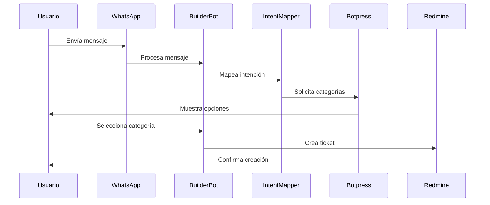
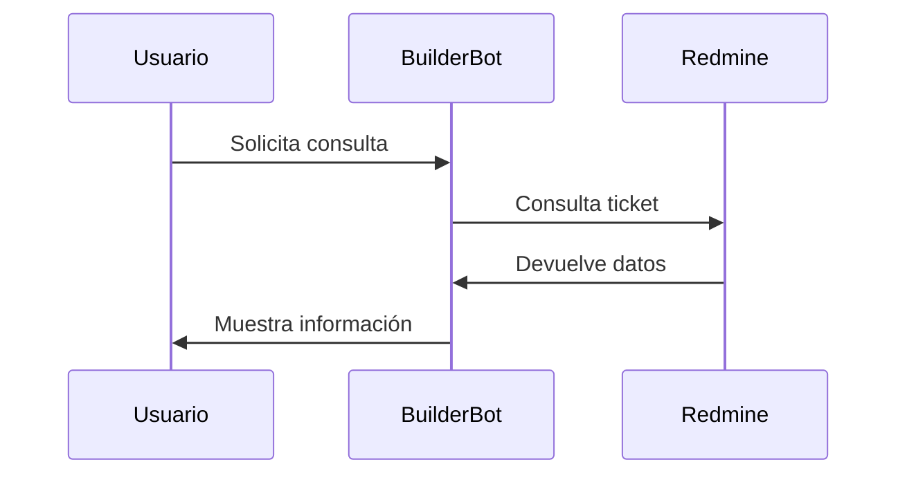

# Documentación Técnica T-BOT

## 🏗️ Arquitectura del Sistema

### Componentes Core
1. **WhatsApp Layer (Baileys)**
   - Gestión de conexión WebSocket
   - Manejo de eventos de mensajería
   - Procesamiento de multimedia

2. **BuilderBot Core**
   - Gestión de sesiones de usuario
   - Manejo de estados de conversación
   - Sistema de routing de mensajes
   - Gestión de errores y reconexión

3. **Intent Mapper**
   - Análisis de mensajes entrantes
   - Mapeo a intenciones del sistema
   - Gestión de flujos conversacionales
   - Validación de entradas

4. **Botpress NLP**
   - Procesamiento de lenguaje natural
   - Detección de intenciones
   - Entrenamiento de modelos
   - Generación de respuestas contextuales

5. **Ticket Flow**
   - Lógica de negocio de tickets
   - Validación de datos
   - Gestión de estados de tickets
   - Integración con sistemas externos

### Integraciones Externas
1. **Redmine API**
   - Creación de tickets
   - Consulta de estados
   - Actualización de tickets
   - Gestión de usuarios

2. **PostgreSQL**
   - Almacenamiento de sesiones
   - Cache de datos
   - Logs del sistema
   - Métricas y analytics

## 🔄 Flujos del Sistema

### 1. Generación de Ticket


### 2. Consulta de Ticket


## 🛠️ Configuración Técnica

### Variables de Entorno
```env
# WhatsApp
WHATSAPP_SESSION=builderbot-session

# Botpress
BOTPRESS_URL=http://botpress:3000
BOT_ID=tbot

# Redmine
REDMINE_URL=https://incidentes.mpftucuman.gob.ar/
REDMINE_API_KEY=tu-api-key

# Database
DB_HOST=host.docker.internal
DB_PORT=5432
DB_USER=admin
DB_PASS=tu-contraseña
DB_NAME=tbot
```

### Dependencias Principales
```json
{
  "@builderbot/bot": "^1.0.0",
  "@builderbot/provider-baileys": "^1.0.0",
  "axios": "^0.24.0",
  "dotenv": "^10.0.0",
  "pg": "^8.7.0"
}
```

## 📊 Monitoreo y Logs

### Niveles de Log
1. **DEBUG**: Información detallada de desarrollo
2. **INFO**: Eventos normales del sistema
3. **WARN**: Advertencias y errores recuperables
4. **ERROR**: Errores críticos que requieren atención

### Métricas Clave
- Tiempo de respuesta
- Tasa de éxito de mensajes
- Uso de memoria
- Conexiones activas
- Tickets procesados/hora

## 🔐 Seguridad

### Autenticación
- Tokens JWT para APIs
- API Keys para servicios externos
- Encriptación de datos sensibles

### Rate Limiting
- Límites por usuario
- Protección contra flood
- Blacklisting de IPs maliciosas

## 🚀 Despliegue

### Requisitos
- Node.js 16+
- PostgreSQL 13+
- Redis (opcional)
- PM2 o similar

### Pasos de Despliegue
1. Clonar repositorio
2. Instalar dependencias
3. Configurar variables de entorno
4. Compilar TypeScript
5. Iniciar con PM2

## 🚦 Quickstart para Desarrolladores

```bash
git clone <url-repositorio>
cd base-ts-baileys-postgres
npm install
cp .env.example .env # O edita tu .env
npm run dev # Desarrollo
npm run build && npm start # Producción
```

## Ejemplo de Interacción

```
Usuario: 1
Bot: Selecciona la categoría...
Usuario: 2
Bot: Selecciona la subcategoría...
Usuario: si
Bot: ✅ Ticket creado con éxito...
Bot: 📝 Por favor, calificá la atención: 1️⃣ Mala 2️⃣ Buena 3️⃣ Muy Buena 4️⃣ Excelente
Usuario: 4
Bot: ¡Gracias por tu calificación! La conversación ha finalizado.
```
